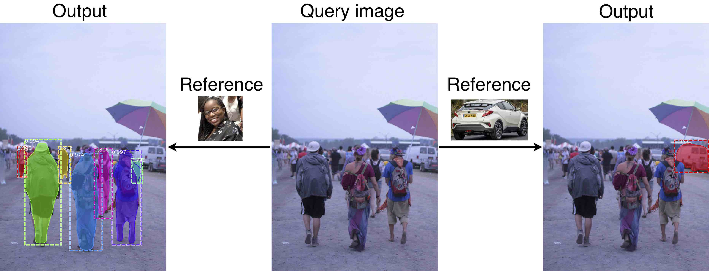
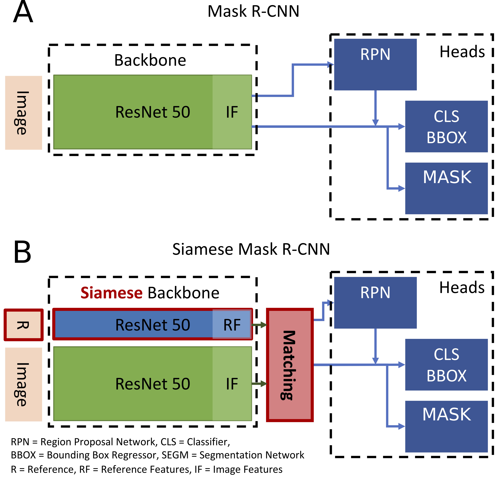

# Siamese Mask R-CNN

This is the official implementation of Siamese Mask R-CNN from [One-Shot Instance Segmentation](https://arxiv.org/abs/1811.11507). It is based on the [Mask R-CNN](https://arxiv.org/abs/1703.06870) implementation by [Matterport](https://github.com/matterport/Mask_RCNN).

The repository includes:
- [x] Source code of Siamese Mask R-CNN
- [x] Training code for MS COCO
- [x] Evaluation on MS COCO metrics (AP)
- [x] Training and evaluation of one-shot splits of MS COCO
- [x] Pre-trained weights for ImageNet
- [x] Training code to reproduce the results from the paper
- [ ] Pre-trained weights for MS COCO and the one-shot splits
- [ ] Code to evaluate models from the paper
- [ ] Code to generate paper figures

## One-Shot Instance Segmentation



One-shot instance segmentation can be summed up as: Given a query image and a reference image showing an object of a novel category, we seek to detect and segment all instances of the corresponding category (‘person’ on the left, ‘car’ on the right). Note that no ground truth annotations of reference categories are used during training.
This type of visual search task creates new challenges for computer vision algorithms, as methods from metric and few-shot learning have to be incorporated into the notoriously hard tasks ofobject identification and segmentation. 
Siamese Mask R-CNN extends Mask R-CNN - a state-of-the-art object detection and segmentation system - with a Siamese backbone and a matching procedure to perform this type of visual search.

## Installation

### Requirements

Linux, Python 3.4+, Tensorflow, Keras and other dependencies listed in install_requirements.ipynb

### Prepare COCO dataset.

The model requires [MS COCO](http://cocodataset.org/#home) and the [CocoAPI](https://github.com/waleedka/coco). It is recommended to symlink the dataset root and the CocoAPI to `/data`.

### Install dependencies

Run the [install_requirements.ipynb](install_requirements.ipynb) notebook to install all relevant requirements.

## Training

To train a small version of siamese mask r-cnn on MS COCO simply follow the instructions in the [training.ipynb](training.ipynb) notebook. This model runs on a single GPU with 12GB memory.

To train the models reported in the paper execute the notebooks provided in [experiments](experiments). Those models need 4 GPUs with 12GB memory each.

## Evaluation

To evaluate and visualize a models results run the [evaluation.ipynb](evaluation.ipynb) notebook. Make sure to use the same config as used for training the model.

## Model description

Siamese Mask R-CNN is designed as a minimal variation of Mask R-CNN which can perform the visual search task described above. For more details please read the [paper](https://arxiv.org/abs/1811.11507).


<p align="center">
 
</p>

## Citation

If you use this repository or want to reference our work please cite our paper:
```
@article{michaelis_one-shot_2018,
	title = {One-{Shot} {Instance} {Segmentation}},
	author = {Michaelis, Claudio and Ustyuzhaninov, Ivan and Bethge, Matthias and Ecker, Alexander S.},
	year = {2018},
  journal = {arXiv},
  url = {http://arxiv.org/abs/1811.11507},
```
